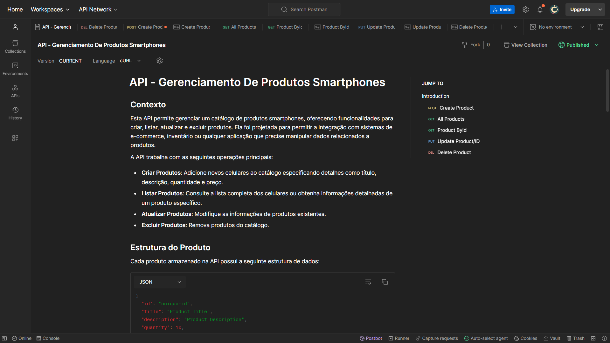

# API - Gerenciamento De Produtos Smartphones

#### 🌟 Bem-vindo à API de Produtos. Esta API permite executar operações CRUD (Criar, Ler, Atualizar e Deletar) em uma lista de produtos. Para facilitar a integração e os testes, disponibilizamos uma documentação interativa no Postman, onde é possível explorar todas as funcionalidades, incluindo rotas e exemplos de requisições.

 <div align="center">

 

[ ( Clique aqui para saber mais da documentação) ](https://raizertech.vercel.app/)

<br>

<div align="center">
  
 [Demonstração-Postman] 

 

<br>

***
<div align="left">

## Índice
- Instalação
- Instruções
- Observações

## Instalação com bash
- Clone o repositório:
```
git clone https://github.com/seu-usuario/nome-do-repositorio.git
```
- Navegue até o diretório do projeto:
```
cd nome-do-repositorio
```
- Instale as dependências:
```
npm install express fetch filesystem joi dotenv winston
```
- OBS: Foi instalado a Biblioteca Joi para validação de dados.
<br>

- Instale biomejs: Pois é uma ferramenta moderna de desenvolvimento que combina funcionalidades de linting, formatação de código e compilação em um único pacote.

```
npm install --save-dev --save-exact @biomejs/biome
```

<br>

- Inicie o servidor:
```
npm run nodemon
```
- Que vai já estar no ``package.json``
<br>

- O servidor será iniciado em http://localhost:3000.

***
##  Instruções para realizar operações de CRUD com Produtos!  
🔊 Para acessar os produtos, adicione '/api/products' ao final da URL (http://localhost:3000) e atualize a página.

👉 Para começar a usar a API, acesse o link do ``Postman``: (https://www.postman.com/),

✨ Esta ``API`` permite experimentar as seguintes ações:

```
➕ Use `POST/api/products`em (json) para adicionar novos produtos incríveis! 
Exemplo de itens
{
  "id": "unique-id",
  "title": "Product Title",
  "description": "Product Description",
  "quantity": 10,
  "price": 99.99
}

🔍 Faça uma requisição (`GET/api/products`) para visualizar todos os produtos.

😃 Faça uma requisição (`GET /api/products/:id`) para visualizar um produto específico, selecionando-o pelo seu ID.

✏️ Atualize o produto existente da lista (GET) com uma requisição (`PUT /api/products/:id`).

🗑️ E não esqueça, você pode remover produtos com (`DELETE /api/products/:id`) da lista (GET).
```    

***
### Observações
Para testar a API, você pode usar ferramentas como o Postman ou curl.
A API está configurada para rodar localmente na porta 3000, mas você pode definir uma porta diferente configurando a variável de ambiente PORT.
O servidor retornará uma mensagem de erro 404 se o item não for encontrado para as requisições GET, PUT ou DELETE.

*** 
## Tecnologias
 Tecnologias utilizadas no projeto:

- ``JavaScript (JS)`` 
"Linguagem de Programação do Navegador". 
"Scripting Dinâmico para Web".
<br>

- ``Node.js``
"Ambiente de Execução JavaScript do Lado do Servidor".
"Servidor Escalável em JavaScript".
<br>

- ``Express.js``
"Framework Web Minimalista para Node.js".
"Backend Rápido para Aplicações Web".
<br>

- ``fs``
- "Módulo de Sistema de Arquivos para Node.js".
"Manipulação de Arquivos de Forma Eficiente no Servidor".` 
<br>

- ``Vercel (para deploy)``
-"Plataforma para Deploy Automático de Aplicações Web".
- "Hospedagem e Escalabilidade para Frontend e Backend".
<br>

- ``Postman``
"Ferramenta de Teste de API para Desenvolvedores".
"Simulação e Automação de Requisições HTTP".
<br>

 - ```Git```
 "Sistema de controle de versões"
 <br>

- ```Github```
"Plataforma para hospedagem de código-fonte"
<br>

- ```Visual Studio Code```
"Editor de código-fonte"
<br>

***
## Licença
- Esse projeto está sob a licença MIT.
<br>

***
 Autor

<p>
    
    <p>&nbsp&nbsp&nbspRafaelRaizer-Dev<br>
    &nbsp&nbsp&nbsp<a href="https://api.whatsapp.com/send/?phone=47999327137">Whatsapp</a>&nbsp;|&nbsp;<a href="https://www.linkedin.com/in/rafael-raizer//">LinkedIn</a>&nbsp;|&nbsp;<a href="https://github.com/RaizerTechDev">GitHub</a>|&nbsp;<a href="https://public.tableau.com/app/profile/rafael.raizer">Tableau</a>|&nbsp;<a href="https://raizertechdev-portfolio.netlify.app/">Portfólio</a>&nbsp;</p>
</p>
